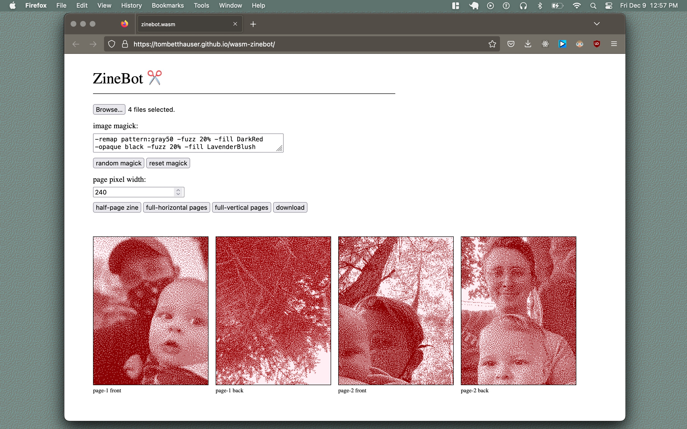

# Wasm Zinebot ✂️

A multi-purpose zine-building script initially built in bash for the command line translated to use a Web Assembly implementation of Image Magick utilities.

I'm actively bug hunting and trying to think of features to add so you find anything or can think of any useful functionality open an issue, make a pr or send me a fax!

https://tombetthauser.github.io/wasm-zinebot

http://tombetthauser.com

---

---

# Planned Features
- [X] full-page vertical
- [X] full-page horizontal
- [X] half-page vertical [side-staple]
- [ ] half-page vertical [clam-shell]
- [ ] half-page horizontal [side-staple]
- [ ] quarter-page vertical [side-staple]
- [ ] quarter-page vertical [clam-shell]
- [ ] quarter-page horizontal [side-staple]
- [ ] third-page vertical [side-staple]
- [ ] sixth-page vertical [side-staple]
- [ ] eighth-page vertical [side-staple]
- [ ] cd-booklet zine [side-staple]
- [ ] j-card zine
- [ ] pdf output button